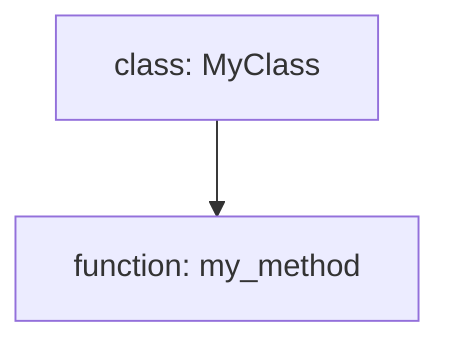

# CopyClip

CopyClip is a high-performance CLI tool that intelligently scans directory trees, aggregates file contents, and copies them to the clipboard in a structured, AI-friendly format. It supports smart filtering, token minimization, and multiple output modes to streamline sharing codebases or documentation with AI assistants and team members.

## Features

- Fast and efficient directory scanning with ignore pattern support
- Concurrent file reading with progress feedback
- Smart filtering with presets and custom include/exclude patterns
- Token minimization modes to reduce clipboard content size
- Flow Diagram Mode for visualizing Python code structure
- Cross-platform clipboard integration with fallback options
- Detailed token counting and context window analysis
- Flexible output options including clipboard, file, and stdout

## CLI Options

- `folder` (positional): Path to the base folder (default: current directory)
- `--extension`: File extension to include, e.g., `.go` (optional)
- `--preset`: Use predefined filters (code, docs, styles, configs)
- `--include`: Glob patterns to include (comma-separated)
- `--exclude`: Glob patterns to exclude (comma-separated)
- `--only`: Restrict to specific subpaths (comma-separated)
- `--max-file-size`: Skip files larger than this size in bytes (default: 10MB)
- `--concurrency`: Max concurrent file reads (auto-detected if not set)
- `--no-progress`: Disable progress bars
- `--ignore-file`: Custom ignore file path
- `--output`: Write output to file in addition to clipboard
- `--minimize`: Token minimization mode; choices:
  - `basic`: Remove comments and whitespace
  - `aggressive`: More aggressive token reduction
  - `structural`: Structural code minimization
  - `contextual`: Add contextual descriptions using LLM
  - `flowdiagram`: Generate flow diagrams for Python files (Mermaid format)
- `--view`: Output view mode; choices:
  - `text`: Textual summaries only (default)
  - `flow`: Flow diagrams only
  - `both`: Both textual summaries and flow diagrams
- `--model`: Specify LLM model for token counting and contextual minimization
- `--follow-symlinks`: Follow symlinks during scan

## Flow Diagram Mode

CopyClip includes a **Flow Diagram Mode** that generates visual flow diagrams of Python source files using the [Mermaid](https://mermaid-js.github.io/) graph syntax. This feature helps visualize the structure of Python code by showing classes and functions and their hierarchical relationships, making it easier to understand complex codebases at a glance.

### Purpose and Benefits

- Provides a clear, visual representation of Python code structure.
- Helps developers and AI assistants quickly grasp relationships between classes and functions.
- Complements textual summaries by offering an intuitive diagram.
- Useful for code reviews, documentation, and onboarding new team members.

### CLI Options

- `--flow-diagram` (deprecated): Generates flow diagrams for Python files and includes them in the output. Use the `--view` option instead.
- `--view` (choices: `text`, `flow`, `both`): Controls the output mode.
  - `text`: Outputs textual summaries of file contents (default).
  - `flow`: Outputs only the flow diagrams in Mermaid format.
  - `both`: Outputs both textual summaries and flow diagrams.

### Mermaid Diagram Format

The flow diagrams are generated in Mermaid's **graph TD** format, where:

- Nodes represent classes and functions.
- Edges represent hierarchical relationships (e.g., functions inside classes).
- The diagram can be rendered using Mermaid live editors or integrated into Markdown viewers that support Mermaid.

Example snippet of Mermaid syntax generated:



### Usage Examples

Generate textual summaries only (default):

```bash
copyclip ./my_project --view text
```

Generate flow diagrams only:

```bash
copyclip ./my_project --view flow
```

Generate both textual summaries and flow diagrams:

```bash
copyclip ./my_project --view both
```

Legacy usage with deprecated flag (equivalent to `--view both`):

```bash
copyclip ./my_project --flow-diagram
```

## Notes

- Flow diagrams are generated only for Python (`.py`) files.
- If both textual and flow outputs are requested, flow diagrams are appended after the textual content.
- The feature uses Python's AST module for parsing and caches results for performance.
- Token counting and contextual minimization require specifying an LLM model.
- Supports piping output to stdout or writing to a file with `--output`.

---

For full CLI help and options, run:

```bash
copyclip --help
```
